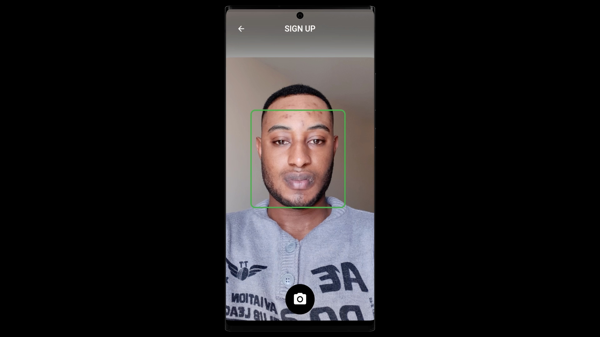
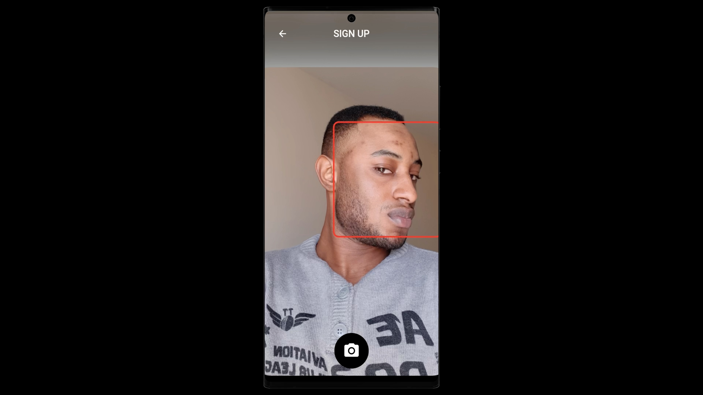
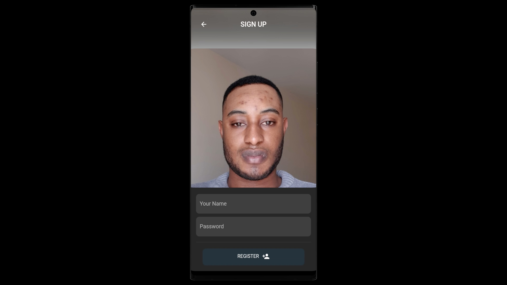
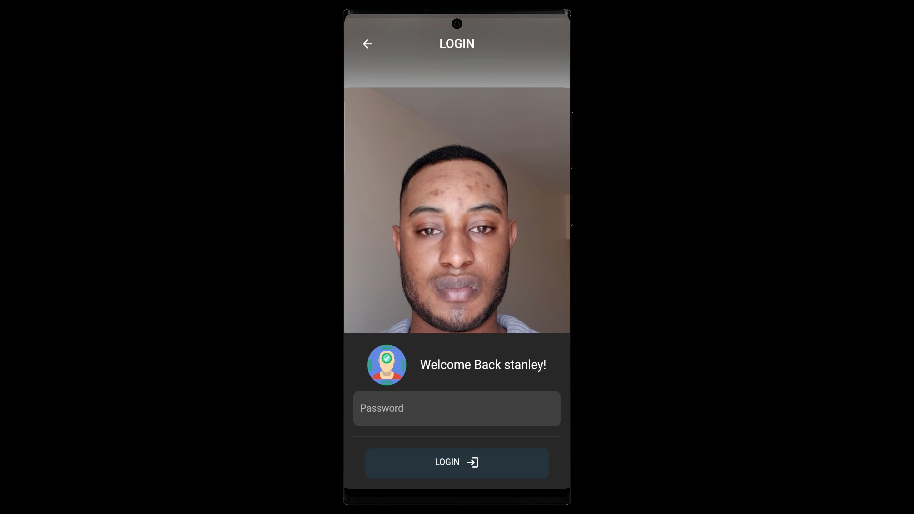
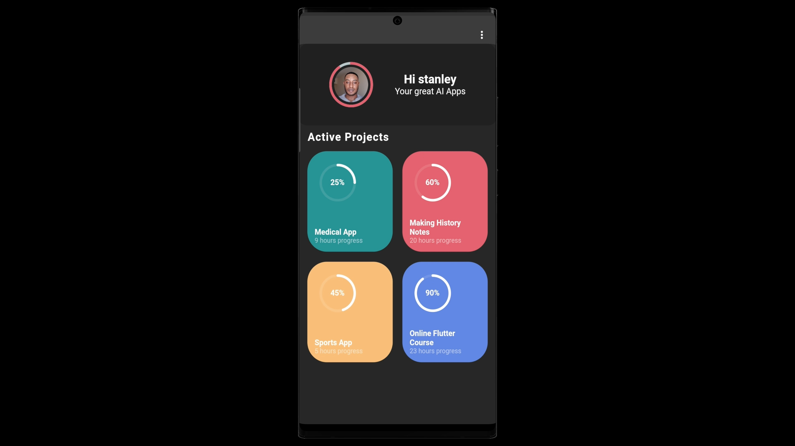

# smartstan

Face Recognition and Authentication App with TensorFlow Lite.

Simple Face Recognition authentication (Sign up + Sign in). It works with two device vision models working together, the google ML kit vision model and MobileFaceNet model.

## [Watch it on YouTube](https://www.youtube.com/watch?v=PgA3A8M5R0I)

**Packages we are using:**

- flutter_svg: [link](https://pub.dev/packages/flutter_svg)

### Preview

## Screens it contains:

=> Login

=> Sign Up

## Photos

